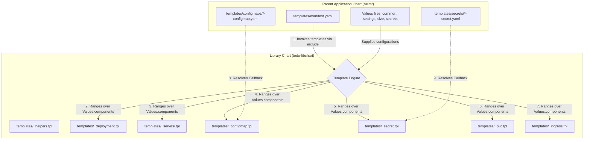

# Enterprise Kubernetes Platform: Helm Repository Architecture & Operations Guide

This guide details the reusable Helm ecosystem designed for banking, financial, and enterprise microservice architectures. 

It explains the decoupled **Library-Application Pattern** implemented in this repository, showing how standard resource definitions are isolated from service configurations, how to execute local runs, and how to scale the platform.

---

## 1. Core Architectural Blueprint

In production enterprise platforms, hosting dozens of microservices with traditional, standalone Helm charts leads to duplicate manifests, configuration drift, and high maintenance overhead. 

To solve this, we separate concerns into a two-layer structure:



### Decoupled Separation of Concerns

- **Library Chart (`todo-libchart`)**: Contains all Kubernetes resource engines (Deployments, Services, ConfigMaps, Secrets, PVCs, Ingresses, HPAs, PDBs). Standardizes resource structures, label schemas, volume mounts, security contexts, and probes. It is non-deployable on its own (`type: library`).
- **Parent Application Chart (`helm/`)**: Orchestrates the manifests, provides environment configuration variables, and defines microservice component scopes.

---

## 2. Directory Structure

```text
helm/
├── Chart.yaml              # Parent metadata and library dependency link
├── Chart.lock              # Lock file generated by helm dependency build
├── values.yaml             # Default placeholder values file
├── values-common.yaml      # Baseline platform, namespace, and ingress settings
├── values-settings.yaml    # Microservices components definition maps
├── values-size.yaml        # Sizing maps (replicas, CPU/Memory request/limits, PVC sizes)
├── values-secrets.yaml     # Plain-text credentials (encrypted in prod git)
│
├── templates/
│   ├── manifest.yaml       # Single orchestrator file invoking library resources
│   │
│   ├── configmaps/         # ConfigMap callback templates
│   │   ├── api-configmap.yaml
│   │   ├── ui-configmap.yaml
│   │   └── db-configmap.yaml
│   │
│   └── secrets/            # Secret callback templates
│       └── db-secret.yaml
│
└── charts/
    └── todo-libchart/      # Shared platform Helm library chart (type: library)
        ├── Chart.yaml
        └── templates/      # Abstract generic K8s templates (_deployment.tpl, etc.)
```

---

## 3. Key Helm Design Patterns

### A. Component-Driven Loop
Instead of duplicating templates per microservice, the parent chart's values file lists all workloads inside a single, structured dictionary called `components`. The library chart loops over this map to generate manifests:

```yaml
{{- define "todo-libchart.deployment.tpl" -}}
{{- $root := . -}}
{{- range $key, $val := .Values.components -}}
  {{- if and ($val.enabled | default false) (eq ($val.kind | default "Deployment") "Deployment") }}
    {{- with $root }}
apiVersion: apps/v1
kind: Deployment
metadata:
  name: {{ $val.deploymentName | default (printf "%s-deployment" $val.name) }}
  # ...
    {{- end }}
  {{- end }}
{{- end }}
{{- end }}
```

### B. Dynamic Callback Architecture
Workloads require distinct configurations (e.g. `appsettings.json` for .NET or `application.properties` for Java). The library handles this via a **Callback Pattern**:
1. The library loops over components. If a component has `configMapEnabled: true`, it calls the parent template: `{{- include (printf "%s-configmap" $val.name) (dict "root" . "component" $val) }}`.
2. The parent defines this callback block (e.g. `todo-api-configmap`) in `templates/configmaps/api-configmap.yaml`:
   ```yaml
   {{- define "todo-api-configmap" -}}
   {{- $component := .component -}}
   JWT_ISSUER: {{ $component.config.jwtIssuer | quote }}
   JWT_AUDIENCE: {{ $component.config.jwtAudience | quote }}
   # ...
   {{- end -}}
   ```
3. The library chart receives these variables, wraps them inside the standard ConfigMap structure (namespace, common labels, annotations), and outputs the final manifest.

### C. Advanced Template Expansion (`tpl` function)
To support environment variables referencing other properties (such as database hosts or ports) dynamically:
```yaml
env:
  - name: DB_CONNECTION_STRING
    value: "Server={{ .Values.components.db.config.host }};Port={{ .Values.components.db.service.port }};..."
```
The library evaluates these value strings at rendering time using Go's `tpl` function:
`value: {{ tpl (toString $env.value) $ | quote }}`

---

## 4. Operational Playbook: How to Build & Run

Ensure you have [Helm 3](https://helm.sh/docs/intro/install/) installed.

### Step 1: Package & Link Dependencies
Because the library chart `todo-libchart` resides inside the `charts/` subdirectory of the parent chart, you must link it before linting or rendering:
```bash
# Run from the workspace root directory:
helm dependency build helm/
```

### Step 2: Validate Templates (Lint)
To run a syntax and integrity check against all configurations:
```bash
helm lint helm/ -f helm/values-common.yaml -f helm/values-settings.yaml -f helm/values-size.yaml -f helm/values-secrets.yaml
```

### Step 3: Render Manifests (Dry-run / Preview)
Compile the templates locally and print the output YAML manifests to inspect variables and indentation:
```bash
helm template todo-app helm/ -f helm/values-common.yaml -f helm/values-settings.yaml -f helm/values-size.yaml -f helm/values-secrets.yaml
```

To save the rendered output to a file for auditing:
```bash
helm template todo-app helm/ -f helm/values-common.yaml -f helm/values-settings.yaml -f helm/values-size.yaml -f helm/values-secrets.yaml > rendered-manifests.yaml
```

### Step 4: Deploy to a Kubernetes Cluster
To deploy the entire stack to your current Kubernetes context (e.g. Minikube):
```bash
helm install todo helm/ -f helm/values-common.yaml -f helm/values-settings.yaml -f helm/values-size.yaml -f helm/values-secrets.yaml
```

### Step 5: Access the Application (Port Forwarding)
To access the UI application on your local machine, port-forward the `ui-service` service to port `8081` (assuming deployment inside the `todo-app` namespace):
```bash
kubectl port-forward svc/ui-service 8081:80 -n todo-app
```
Then, open your web browser and navigate to [http://localhost:8081](http://localhost:8081).

### Step 6: Upgrade / Apply Changes
Whenever you update a values file or template, apply updates in place:
```bash
helm upgrade todo helm/ -f helm/values-common.yaml -f helm/values-settings.yaml -f helm/values-size.yaml -f helm/values-secrets.yaml
```

### Step 7: Uninstall Release
To uninstall and clean up all deployed resources:
```bash
helm uninstall todo
```

---

## 5. Development Playbook: Onboarding a New Microservice

To add a new microservice (e.g., `payment-service`):

### Step 1: Define under `components`
Add the new service configuration to `helm/values-settings.yaml`:
```yaml
components:
  payment:
    enabled: true
    name: todo-payment
    deploymentName: payment-deployment
    serviceName: payment-service
    image:
      repository: company/payment-api
      tag: v1.0.0
      pullPolicy: IfNotPresent
    service:
      port: 8080
      portName: http
```

### Step 2: Configure Sizing
Allocate resources in `helm/values-size.yaml`:
```yaml
components:
  payment:
    replicaCount: 2
    resources:
      limits:
        cpu: 500m
        memory: 512Mi
      requests:
        cpu: 100m
        memory: 256Mi
```

### Step 3: Define Custom Callback (Optional)
If your service requires application configuration (ConfigMap), set `configMapEnabled: true` in step 1, and create `helm/templates/configmaps/payment-configmap.yaml`:
```yaml
{{- define "todo-payment-configmap" -}}
PAYMENT_PROVIDER: "Stripe"
MAX_RETRY_ATTEMPTS: "3"
{{- end -}}
```

Now, run `helm template todo-app helm/ -f ...` and you will see the new Deployment, Service, and ConfigMap dynamically generated for the payment microservice!

---

## 6. Common Pitfalls & Best Practices

- **Strict Trim Controls**: Inside `_helpers.tpl` and loops, always use `{{-` and `-}}` to trim spaces. If ignored, Go's template parser will output blank lines in the middle of manifest arrays, triggering lint errors (`invalid Yaml document separator: ---`).
- **Immutable Selectors**: Deployment label selectors (`spec.selector.matchLabels`) are immutable. Always ensure that the component `name` (which drives the selectors) is chosen carefully. Changing it on an active release will fail to apply; you must delete the deployment or use specific selector overrides.
- **Resource Requests/Limits**: Ensure that all production-bound services have CPU/Memory requests and limits set in `values-size.yaml`. Leaving them empty can lead to Node starvation.
