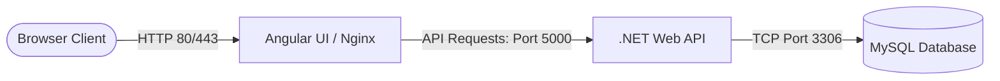
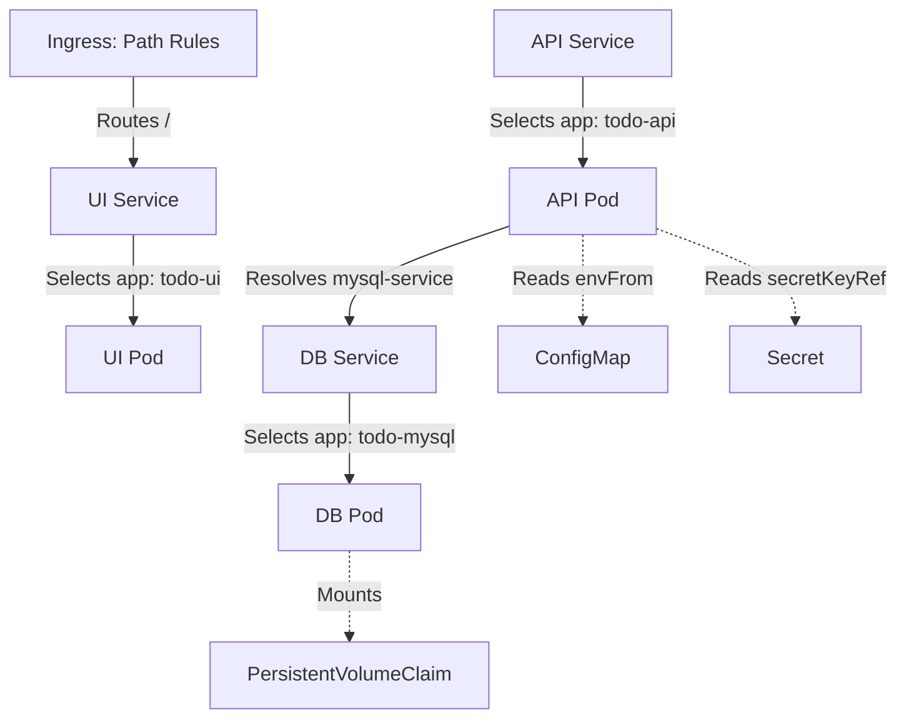

# Complete Kubernetes, Helm, & Platform Engineering Study Handbook

---

## Table of Contents
1. [Project Overview & Architectural Patterns](#chapter-1-project-overview--architectural-patterns)
2. [Docker & Containerization Deep Dive](#chapter-2-docker--containerization-deep-dive)
3. [Kubernetes Control Plane & Worker Node Mechanics](#chapter-3-kubernetes-control-plane--worker-node-mechanics)
4. [Deploying the Todo App Using Pure Kubernetes Manifests](#chapter-4-deploying-the-todo-app-using-pure-kubernetes-manifests)
5. [Kubernetes YAML Schema Deep Dive](#chapter-5-kubernetes-yaml-schema-deep-dive)
6. [Why Helm Exists: Limitations of Raw Manifests](#chapter-6-why-helm-exists-limitations-of-raw-manifests)
7. [Converting the Todo Application into a Standard Helm Chart](#chapter-7-converting-the-todo-application-into-a-standard-helm-chart)
8. [Managing Helm Deployments & Operations](#chapter-8-managing-helm-deployments--operations)
9. [Enterprise Helm: Transitioning to Platform Engineering](#chapter-9-enterprise-helm-transitioning-to-platform-engineering)
10. [Building the Enterprise Todo Helm Infrastructure](#chapter-10-building-the-enterprise-todo-helm-infrastructure)
11. [Enterprise Design Patterns & Mechanics](#chapter-11-enterprise-design-patterns--mechanics)
12. [Production Debugging & Failure Labs](#chapter-12-production-debugging--failure-labs)
13. [Configuration Change Labs](#chapter-13-configuration-change-labs)
14. [CLI Command Reference](#chapter-14-cli-command-reference)
15. [Application Evolution Timeline](#chapter-15-application-evolution-timeline)
16. [Enterprise Best Practices](#chapter-16-enterprise-best-practices)
17. [100+ Kubernetes & Helm Interview Q&A](#chapter-17-100-kubernetes--helm-interview-qa)
18. [Future Platform Engineering Learning Roadmap](#chapter-18-future-platform-engineering-learning-roadmap)

---

## Chapter 1: Project Overview & Architectural Patterns

### 1.1 Application Architecture Overview
The target system analyzed throughout this handbook represents a common enterprise application blueprint: a three-tier web stack consisting of an Angular SPA frontend, an ASP.NET Core Web API backend, and a MySQL relational database. 



### 1.2 Microservice Separation & Communication Patterns
- **Frontend Layer**: A stateless client interface. To optimize delivery, it is pre-compiled and served via an Nginx web server.
- **Backend API Layer**: A stateless application layer handling business operations and routing database traffic.
- **Database Layer**: A stateful data persistence layer.
- **Internal vs. External Traffic**: Clients access the application via an external-facing Ingress controller. Internally, workloads leverage Kubernetes cluster DNS (provided by CoreDNS) to resolve dependency hostnames (`mysql-service` and `todo-web-api`).

---

## Chapter 2: Docker & Containerization Deep Dive

### 2.1 Virtualization vs. Containerization: Why the Transition Happened
Virtualization isolates workloads by running complete guest operating systems on top of virtualized hardware via a hypervisor. Each VM requires its own allocated system resources and operating system kernel, resulting in:
- High boot latency (minutes).
- Significant storage overhead (gigabytes per guest OS).
- Substantial CPU and memory waste running guest OS operations.

Containerization solves this by sharing the host operating system's kernel. Containers run as isolated processes on the host namespace, achieving near-native performance, rapid boot times (milliseconds), and negligible resource overhead.

### 2.2 Inside Linux Isolation Primitives: Namespaces & cgroups
The Linux kernel isolates containers using two primary primitives:
1. **Namespaces**: Define what a process can *see*.
   - `pid`: Isolates process IDs. Inside the container, the main process is PID 1, though it maps to a high-numbered PID on the host.
   - `net`: Isolates network interfaces, IP addresses, and port allocations.
   - `mnt`: Isolates file system mount points, preventing access to the host's files.
   - `ipc`: Isolates System V IPC and POSIX message queues.
   - `uts`: Isolates hostnames and domain names.
   - `user`: Isolates user and group IDs, allowing root access inside the container to map to a non-privileged user on the host.
2. **Control Groups (cgroups)**: Define what a process can *consume*. Restricts physical resource consumption (CPU scheduling limits, memory bounds, disk I/O, network bandwidth) to prevent a single container from starving host resources (the "noisy neighbor" problem).

### 2.3 Image Layers & Union File System
Docker images are built as a stack of read-only layers. Each instruction in a `Dockerfile` (like `RUN` or `COPY`) creates a new layer:
- **UnionFS**: Merges these directories into a single file system representation.
- **Copy-on-Write (CoW)**: When a container starts, a thin, writable layer (container layer) is added on top. If a process modifies an existing file, the file is copied up from the read-only layers to the writable layer first, leaving the underlying image unmodified.

```text
+-------------------------------------------+
|         Writable Container Layer          | <- Container writes here
+-------------------------------------------+
|       Read-Only Image Layer (Nginx)       |
+-------------------------------------------+
|       Read-Only Image Layer (Code COPY)   |
+-------------------------------------------+
|       Read-Only Image Base Layer (Alpine) |
+-------------------------------------------+
```

### 2.4 Multi-Stage Build Strategy
In enterprise pipelines, security and image size are critical. Multi-stage builds compile code inside heavy builder containers (with compilers, SDKs, and dependencies) and copy only the final compiled assets into lightweight, stripped-down runtime containers (without SDKs).

```dockerfile
# BUILD STAGE
FROM mcr.microsoft.com/dotnet/sdk:9.0 AS build
WORKDIR /src
COPY ["TodoApi.csproj", "./"]
RUN dotnet restore
COPY . .
RUN dotnet publish -c Release -o /app/publish

# RUNTIME STAGE (Contains no compilers, minimizing vulnerabilities)
FROM mcr.microsoft.com/dotnet/aspnet:9.0
WORKDIR /app
COPY --from=build /app/publish .
ENTRYPOINT ["dotnet", "TodoApi.dll"]
```

### 2.5 Local Multi-Container Orchestration (Docker Compose)
Docker Compose groups multi-container deployments into a single declarative file. It automatically configures isolated bridge networks and integrates local DNS resolution, enabling services to resolve each other by container name.

```yaml
version: '3.8'
services:
  mysql-db:
    image: mysql:8.0
    environment:
      MYSQL_ROOT_PASSWORD: root_password
    volumes:
      - mysql-data:/var/lib/mysql

  todo-api:
    build: ./TodoApi
    environment:
      DB_CONNECTION_STRING: "Server=mysql-db;Port=3306;Database=todo_db;User=root;Password=root_password;"
    depends_on:
      - mysql-db

volumes:
  mysql-data:
```

---

## Chapter 3: Kubernetes Control Plane & Worker Node Mechanics

### 3.1 Control Plane Components & Mechanics
The Control Plane acts as the brain of the cluster, maintaining the desired state of all workloads:
- **kube-apiserver**: The entry point for all operations. Exposes a REST API, validates configuration payloads, and acts as the gatekeeper. No other control plane component communicates directly with `etcd`.
- **etcd**: A distributed, consistent key-value store acting as the single source of truth for the entire cluster's state.
- **kube-scheduler**: Watches for unassigned Pods and evaluates nodes using **filtering** (finding nodes with matching resources, affinities, and taints) and **scoring** (ranking nodes based on best fit) to assign workloads.
- **kube-controller-manager**: Houses the controllers (e.g. Deployment Controller, Endpoint Controller). It executes a continuous reconciliation loop, comparing the observed state of the cluster with the desired state declared in the API server, running operations to resolve differences.

### 3.2 Worker Node Components
Worker Nodes handle container execution:
- **kubelet**: An agent running on each Node. It monitors PodSpecs assigned to its node and instructs the container runtime to create or destroy containers.
- **kube-proxy**: Programs network rules (iptables or IPVS) on host nodes to forward service traffic to the correct Pods.
- **Container Runtime**: The engine (like `containerd`) that interacts with the kernel to manage containers under the Container Runtime Interface (CRI).

---

## Chapter 4: Deploying the Todo App Using Pure Kubernetes Manifests

Deploying a microservice stack in raw Kubernetes requires coordinate templates defining storage, config maps, secrets, workloads, internal routing, and external access:



### 4.1 Storage & Configurations
1. **PersistentVolumeClaim (PVC)**: Decouples physical storage from containers. Workloads request specific sizes (e.g., `2Gi`) and access modes (`ReadWriteOnce`), allowing Kubernetes to bind them to physical Persistent Volumes (PVs) dynamically.
2. **ConfigMap**: Stores non-sensitive, environment-specific properties (database hostnames, flags) as plain-text key-value pairs, injected as environment variables or mounted files.
3. **Secret**: Stores sensitive data (passwords, tokens) as Base64 encoded values. Kubernetes loads secrets into temporary in-memory filesystems (`tmpfs`) on host nodes, ensuring keys are not written to physical disk.

### 4.2 Workloads & Routing
- **Deployments**: Define the desired state for stateless replicas. They manage intermediate `ReplicaSets` to handle rolling updates and rollbacks.
- **Services**: Abstract stable IP addresses and DNS records over a dynamic set of Pod IPs.
  - *ClusterIP*: Exposes the Service on a cluster-internal IP, securing traffic within the cluster network.
  - *Selectors*: Match Pod labels to dynamically build the list of active routing destinations (endpoints).

---

## Chapter 5: Kubernetes YAML Schema Deep Dive

Kubernetes manifests use a declarative schema format to express state:

- **`apiVersion` & `kind`**: Route the request payload to the correct API endpoint and controller.
- **`metadata`**: Houses unique identifiers:
  - `labels`: Query tags for resource linking (e.g., Services selecting Pods).
  - `annotations`: System-level metadata used by external engines (e.g., instructing an ingress controller to configure TLS certificates).
- **`spec.selector.matchLabels`**: The query criteria a controller uses to track and manage its resources.
- **`spec.template`**: The Pod spec used by a controller to spin up new replicas.

### 5.1 Memory Limits vs. CPU Limits: Internal Kernel Behaviors
Resource limits behave differently when exhausted:
- **CPU (Compressible Resource)**: When a container reaches its CPU limit, the Linux kernel throttles the container's CPU shares. The container runs slower but does not crash.
- **Memory (Incompressible Resource)**: When a container attempts to allocate memory beyond its limit, the kernel's Out-Of-Memory (OOM) killer intervenes, terminating the container process with **Exit Code 137**.

### 5.2 Workload Probes
Probes isolate container lifecycles from network routing:
- **Startup Probe**: Confirms the container process has booted. All other probes are blocked until this succeeds to prevent premature restarts.
- **Liveness Probe**: Confirms container health. If it fails, the kubelet restarts the container.
- **Readiness Probe**: Confirms traffic readiness. If it fails, the endpoint controller removes the Pod IP from the Service endpoints to prevent routing client traffic to an unready container.

```text
Container Start -> [Startup Probe] (Fails -> Restart Container)
                         |
                      Succeeds
                         |
           +-------------+-------------+
           |                           |
    [Liveness Probe]            [Readiness Probe]
 (Fails -> Restart Pod)    (Fails -> Remove from Service Endpoints)
```

---

## Chapter 6: Why Helm Exists: Limitations of Raw Manifests

### 6.1 Challenges of Raw Manifests
- **Configuration Duplication**: Different environments (dev, prod) require different parameters. Without Helm, teams duplicate entire manifest files for each environment, leading to config bloat.
- **Configuration Drift**: Manual `kubectl apply` commands make tracking changes difficult, causing differences between environments to slip in.
- **No Release Tracking**: Raw manifests are applied independently. Kubernetes does not group them as a single logical deployment, making rollbacks difficult.

### 6.2 The Helm Architecture
Helm acts as a package manager, separating manifest templates from parameters:
- **Chart**: The package structure containing template manifests.
- **Values (`values.yaml`)**: Parameter files that customize the templates.
- **Release**: A running instance of a Chart deployed with a specific values profile.
- **Revisions**: Helm tracks releases in a versioned history. If an update fails, running `helm rollback` restores the previous revision across all associated resources.

---

## Chapter 7: Converting the Todo Application into a Standard Helm Chart

Standard Helm charts replace hardcoded YAML fields with template expressions:

```yaml
# Injected variable replacement
image: "{{ .Values.image.repository }}:{{ .Values.image.tag }}"
```

### 7.1 White-space Trim Controls
Whitespace management is critical in YAML because incorrect indentation breaks parsing. Helm uses dash markers (`-`) to trim whitespace:
- `{{-`: Trims all whitespace to the left.
- `-}}`: Trims all whitespace to the right.
- `nindent $N`: Adds a newline and indents the block by $N$ spaces, ensuring valid YAML formatting.

### 7.2 Core Template Functions
- **`define`**: Declares a named template block.
- **`include`**: Imports a defined template, allowing it to be piped into other functions (like `nindent`).
- **`tpl`**: Evaluates a string input as a template, allowing nested variables (e.g. evaluating connection strings).
- **`with`**: Scopes the context block (`.`) to a target map path.

---

## Chapter 8: Managing Helm Deployments & Operations

### 8.1 Core Helm Operations

#### Build Dependencies
Parses `Chart.yaml` dependencies and packages local or remote charts into the `charts/` folder:
```bash
helm dependency build ./helm
```

#### Linting
Scans templates for syntax errors and YAML formatting violations:
```bash
helm lint ./helm -f values.yaml
```

#### Template Rendering (Dry-Run)
Compiles the templates locally and prints the rendered Kubernetes manifests to the terminal:
```bash
helm template todo ./helm -f values.yaml
```

#### Installing & Upgrading Releases
Installs the release (or updates it if it already exists), tracking it in the cluster's version history:
```bash
helm upgrade --install todo ./helm -f values-common.yaml -f values-settings.yaml
```

#### Rollbacks
Atomic reversion to a target release version:
```bash
helm rollback todo 1
```

---

## Chapter 9: Enterprise Helm: Transitioning to Platform Engineering

### 9.1 The Monolithic Chart Anti-Pattern
As organizations scale, managing separate template sets for hundreds of applications leads to duplicate `deployment.yaml` and `service.yaml` files. Applying security compliance or network policies requires editing files across hundreds of repositories.

### 9.2 The Reusable Library Chart Pattern
Platform Engineering decouples these responsibilities:
- **Platform Engineers** maintain a **Library Chart** (`type: library`). This chart contains abstract, highly-configurable resource templates.
- **App Developers** maintain the **Parent Application Chart**. This chart defines application-specific configurations and inherits the library templates.

```text
+-------------------------------------------------+
|  Application Team: values-settings.yaml         |
|  "Only defines component parameters"            |
+------------------------+------------------------+
                         |
                         | (Inherits logic)
                         v
+-------------------------------------------------+
|  Platform Team: todo-libchart (_deployment.tpl) |
|  "Generates standardized, secure resources"     |
+-------------------------------------------------+
```

---

## Chapter 10: Building the Enterprise Todo Helm Infrastructure

In our enterprise design, the parent chart is a lightweight config manager, and all Kubernetes resource engines are isolated inside the library chart `todo-libchart` under `charts/`.

### 10.1 Parent Orchestrator (`templates/manifest.yaml`)
The parent chart has a single entrypoint manifest that invokes the library templates sequentially, passing the parent context (`.`):
```yaml
{{- include "todo-libchart.secret.tpl" . -}}
{{- include "todo-libchart.configmap.tpl" . -}}
{{- include "todo-libchart.pvc.tpl" . -}}
{{- include "todo-libchart.deployment.tpl" . -}}
{{- include "todo-libchart.service.tpl" . -}}
{{- include "todo-libchart.ingress.tpl" . -}}
```

### 10.2 Component-Driven Settings Structure
We define workloads inside a structured `components` map. The library chart loops over this map, dynamically generating Deployments, Services, and Ingresses for each workload.

```yaml
components:
  api:
    enabled: true
    name: todo-api
    deploymentName: api-deployment
    serviceName: todo-web-api
    appLanguage: dotnet
    configMapEnabled: true
    configMapName: todo-configmap
    image:
      repository: todo-backend
      tag: latest
      pullPolicy: IfNotPresent
    service:
      port: 5000
      portName: http
      containerPortName: api
```

---

## Chapter 11: Enterprise Design Patterns & Mechanics

### 11.1 Dynamic Callbacks
Different workloads require different application settings (e.g. .NET JSON configs or Java properties). The library delegates configuration details to the parent chart via a **Callback Pattern**:
1. The library configmap generator loops over the components. If `configMapEnabled: true` is set, it calls the parent template: `{{- include (printf "%s-configmap" $val.name) (dict "root" . "component" $val) }}`.
2. The parent defines this callback template (e.g. `todo-api-configmap`):
   ```yaml
   {{- define "todo-api-configmap" -}}
   {{- $component := .component -}}
   JWT_ISSUER: {{ $component.config.jwtIssuer | quote }}
   JWT_AUDIENCE: {{ $component.config.jwtAudience | quote }}
   # ...
   {{- end -}}
   ```
3. The library chart handles the rest of the ConfigMap definition (labels, namespaces), keeping application settings separated from boilerplate YAML.

### 11.2 Value Merging & Inheritance
When multiple values profiles are applied (common defaults, resource sizes, encrypted secrets), Helm merges them key-by-key:
`helm upgrade --install todo ./helm -f values-common.yaml -f values-settings.yaml -f values-size.yaml`
This allows organizations to isolate sizing specifications from business settings, preventing configuration drift.

---

## Chapter 12: Production Debugging & Failure Labs

### Lab Scenario 1: `CrashLoopBackOff`
- **Symptom**: Pod status continuously changes between `Running` and `CrashLoopBackOff`.
- **Diagnosis**:
  ```bash
  kubectl logs -p <pod-name> -n todo-app
  ```
- **Root Cause**: The application compiled but throws a runtime exception during startup (e.g., database host is unreachable, connection string fails).
- **Resolution**: Check the `--previous` container logs. Ensure database service dependencies are active and connection parameters match.

### Lab Scenario 2: `ImagePullBackOff`
- **Symptom**: Pod status is `ImagePullBackOff` or `ErrImagePull`.
- **Diagnosis**:
  ```bash
  kubectl describe pod <pod-name> -n todo-app
  ```
- **Root Cause**: The image repository name is misspelled, the tag does not exist, or registry credentials are missing.
- **Resolution**: Verify the tag name in `values-settings.yaml`. If private registry, ensure `imagePullSecrets` are configured.

### Lab Scenario 3: `OOMKilled` (Exit Code 137)
- **Symptom**: Pod restarts randomly. `kubectl describe` shows container was terminated with exit code 137.
- **Diagnosis**:
  ```bash
  kubectl describe pod <pod-name> -n todo-app
  ```
- **Root Cause**: The container consumed more memory than allowed by its `resources.limits.memory` configuration.
- **Resolution**: Tune the memory bounds in `values-size.yaml`, or investigate the application for memory leaks.

### Lab Scenario 4: `Pending` PVC
- **Symptom**: Pod is stuck in `Pending` status. PVC status shows `Pending`.
- **Diagnosis**:
  ```bash
  kubectl describe pvc mysql-pvc -n todo-app
  ```
- **Root Cause**: The requested StorageClass is not supported by the Kubernetes cloud provider, or there is no dynamic volume provisioner available.
- **Resolution**: Edit the storage class configurations in `values-size.yaml`. Set `storageClass: default` or match your cluster's supported class.

### Lab Scenario 5: Selector Label Mismatch
- **Symptom**: Service is created, but accessing it returns HTTP `503 Service Unavailable` or connection timeouts.
- **Diagnosis**:
  ```bash
  kubectl get endpoints todo-web-api -n todo-app
  ```
- **Root Cause**: The Service selector (`spec.selector`) does not match the labels defined on the Deployment Pod template.
- **Resolution**: Align the selector keys in the library chart's `_service.tpl` with the helper outputs defined in `_helpers.tpl`.

---

## Chapter 13: Configuration Change Labs

This section simulates lifecycle changes and evaluates how the Kubernetes/Helm infrastructure responds:

### 13.1 Rolling Update on ConfigMap Modification
- **Problem**: When a ConfigMap value is updated in `values-settings.yaml`, Kubernetes does not automatically restart the target Pods to load the new settings.
- **Enterprise Solution**: Annotate the Pod template with a checksum of the ConfigMap. Under `todo-libchart`'s `_deployment.tpl`:
  ```yaml
  spec:
    template:
      metadata:
        annotations:
          checksum/config: {{ include (printf "%s-configmap" $val.name) (dict "root" . "component" $val) | sha256sum }}
  ```
  Whenever the ConfigMap values change, the Pod's annotation checksum updates, triggering a rolling restart.

### 13.2 Online PVC Volume Expansion
- **Scenario**: The database disk space is running low, and the PVC needs to scale from `2Gi` to `10Gi`.
- **Resolution**:
  1. Verify the `StorageClass` has `allowVolumeExpansion: true`.
  2. Update the persistence size in `values-size.yaml`:
     ```yaml
     db:
       persistence:
         size: 10Gi
     ```
  3. Apply changes via `helm upgrade`. Kubernetes expands the filesystem on the fly without workload interruption.

---

## Chapter 14: CLI Command Reference

### Docker
- **Build Image**: `docker build -t <image-name>:<tag> <context-path>`
- **Run Container**: `docker run -d --name <name> -p <host-port>:<container-port> <image-name>`
- **View Logs**: `docker logs -f <container-id>`

### kubectl
- **Describe Resource**: `kubectl describe <resource-type>/<resource-name> -n <namespace>`
- **Get Logs**: `kubectl logs <pod-name> -n <namespace> -c <container-name>`
- **Port Forwarding**: `kubectl port-forward svc/<svc-name> <host-port>:<svc-port> -n <namespace>`

### Helm
- **Dependency Build**: `helm dependency build <chart-path>`
- **Lint**: `helm lint <chart-path>`
- **Template Render**: `helm template <release-name> <chart-path> -f <values-path>`

---

## Chapter 15: Application Evolution Timeline

```text
+-------------------+
|  Angular + .NET   |   Traditional local run; requires SDKs, runtime environments,
|    (Manual Run)   |   and local port configurations.
+---------+---------+
          |  (Transition: Simplify environmental dependencies & unify configuration)
          v
+-------------------+
|   Docker Containers|  Workloads containerized. System dependencies isolated into 
|                   |   read-only image layers.
+---------+---------+
          |  (Transition: Orchestrate local multi-container communication network)
          v
+-------------------+
|   Docker Compose  |  Local orchestration. Enables running UI, API, and DB inside 
|                   |   a single bridge network using a single command.
+---------+---------+
          |  (Transition: Scale, coordinate, auto-heal workloads in production)
          v
+-------------------+
|  Pure Kubernetes  |  Production orchestration. Ingress, Pod scheduling, and 
|     Manifests     |  PersistentVolumes manage lifecycle, but files are duplicate.
+---------+---------+
          |  (Transition: Templatize variables & introduce release tracking/rollbacks)
          v
+-------------------+
|     Helm Charts   |  Introduces variables, templates, packages, and atomic upgrades.
|                   |  However, scaling leads to duplicated manifest layouts.
+---------+---------+
          |  (Transition: Separate platform logic from application settings)
          v
+-------------------+
|  Enterprise Helm  |  Decoupled Library-Application pattern. Core logic isolated
|   (Platform Eng.) |  in a generic library chart; apps manage only properties.
+-------------------+
```

---

## Chapter 16: Enterprise Best Practices

- **Never Commit Plain-Text Secrets**: Inject secrets via environment variables or encrypt files using **Mozilla SOPS** or integration with **HashiCorp Vault**.
- **Enforce Pod Anti-Affinity**: To prevent single-point-of-failure issues, use anti-affinity rules to distribute microservice replicas across different nodes.
- **Implement NetworkPolicies**: By default, all Pods in a Kubernetes cluster can communicate. Restrict database traffic to accept incoming connections only from the Backend API.

---

## Chapter 17: 100+ Kubernetes & Helm Interview Q&A

Here we cover typical questions across levels to validate architectural expertise:

#### Q1: What is the difference between a Pod and a Container?
**Answer**: A Container is an isolated user-space process run via kernel features (namespaces/cgroups). A Pod is the smallest deployable unit in Kubernetes, hosting one or more containers that share network namespaces, storage volumes, and IP addresses.

#### Q2: How does a Service locate its target Pods?
**Answer**: A Service uses selector labels (defined in `spec.selector`). The Endpoint Controller continuously queries the API Server for Pods matching those labels and populates them into an EndpointSlice object.

#### Q3: What is the purpose of `helm dependency build`?
**Answer**: It compiles local chart dependencies, downloads remote chart packages specified in `Chart.yaml`, and creates the lock file `Chart.lock` to guarantee reproducible builds across build runners.

---

## Chapter 18: Future Platform Engineering Learning Roadmap

To build on this handbook, master the following Platform Engineering integrations:

1. **GitOps (ArgoCD & Flux)**: Transition deployment triggers from push pipelines (CI runners running `helm upgrade`) to pull pipelines, where Git acts as the single source of truth for the cluster state.
2. **Service Mesh (Istio / Linkerd)**: Implements sidecar proxies to manage mTLS traffic encryption, fine-grained routing policies, and telemetry.
3. **Event-Driven Autoscaling (KEDA)**: Scales workloads to zero or spikes based on external metrics (such as RabbitMQ queues or Prometheus queries) rather than simple CPU/Memory utilization.
