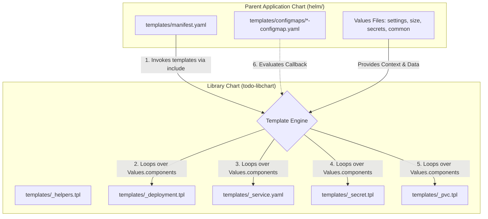

# Platform Engineering Kubernetes Deployment: Reusable Helm Ecosystem

This Helm repository implements a decoupled, two-layer **Library-Application Chart Pattern** designed to separate reusable Kubernetes platform infrastructure logic from application-specific business configurations. 

This architecture allows banking and enterprise institutions to onboard dozens or hundreds of microservices with zero Kubernetes YAML duplication.

---

## 1. Architectural Blueprint



### Separation of Concerns

| Layer | Responsibility | Deliverables | Deployable? | Contains Raw K8s YAML? |
| :--- | :--- | :--- | :--- | :--- |
| **Library Chart** (`todo-libchart`) | Generic Kubernetes templates and resource engines | Deployments, Services, ConfigMaps, Secrets, Ingress, HPAs, PDBs, etc. | **No** (`type: library`) | Yes (Standardized, abstract templating logic) |
| **Parent Chart** (`todo-app`) | Application orchestration, configurations, sizing, and credentials | `manifest.yaml`, callback ConfigMaps/Secrets, value profiles | **Yes** (`type: application`) | No (Only calls the library templates & overrides variables) |

---

## 2. Deep-Dive Mechanics

### A. Manifest Orchestration (`manifest.yaml`)
Instead of duplicate YAML manifests, the parent chart defines a single entry point `templates/manifest.yaml` which sequentially includes library components, passing down the parent context (`.`):

```yaml
{{- include "todo-libchart.serviceaccount.tpl" . -}}
{{- include "todo-libchart.secret.tpl" . -}}
{{- include "todo-libchart.configmap.tpl" . -}}
...
```
Passing the dot `.` merges `.Values`, `.Release`, and `.Chart` of the parent context down to the library.

### B. Component Iteration (`range`)
The library chart loops over the `.Values.components` dictionary using the `range` action. 

```yaml
{{- range $key, $val := .Values.components }}
  {{- if $val.enabled }}
     # Generates resources dynamically for each component
  {{- end }}
{{- end }}
```
Adding another microservice only requires adding its values definition under `components`—**no new Kubernetes manifests are ever written**.

### C. Dynamic Callback Architecture
ConfigMaps and Secrets differ across applications. The library handles this via a **callback pattern**:
1. The library configmap template loops over the components and calls back a template defined in the parent named `(printf "%s-configmap" $component.name)`.
2. The parent defines this callback template (e.g., `todo-api-configmap`) which returns only the required application-specific variables.
3. The library chart wraps this inside the standard ConfigMap skeleton (labels, annotations, namespace) and renders the final manifest.

---

## 3. Configuration Profiles (Values)

We maintain strict isolation of settings across four files:
- **`values-common.yaml`**: Common platform defaults, namespace, global labels, global ingress settings.
- **`values-settings.yaml`**: Component mapping defining repositories, tags, ports, probes, environment variables, volumes, and mounts.
- **`values-size.yaml`**: Sizing profiles including resource limits, CPU/Memory requests, replica counts, and PVC storage sizes.
- **`values-secrets.yaml`**: Sensitive tokens, database passwords, and credentials. Never stored in plain text in production git (typically encrypted via SOPS or populated dynamically via Vault).

---

## 4. Playbooks & Guides

### A. How to Add a New Microservice
To onboard a new service (e.g., `notification-service`), simply append its configuration under the `components` map in `values-settings.yaml`, `values-size.yaml`, and `values-secrets.yaml`:

```yaml
# values-settings.yaml
components:
  notification:
    enabled: true
    name: todo-notification
    image:
      repository: todo-notification-service
      tag: v1.0.0
      pullPolicy: IfNotPresent
    service:
      port: 8080
```

If it requires custom ConfigMap data:
1. Create `templates/configmaps/notification-configmap.yaml` in the parent chart.
2. Define the callback:
```yaml
{{- define "todo-notification-configmap" -}}
NOTIFICATION_TTL: "3600"
LOG_LEVEL: "Debug"
{{- end -}}
```
3. Set `configMapEnabled: true` in the component definition.

### B. How to Extend the Library Chart
If you need to support a new Kubernetes resource (e.g., CronJob):
1. Create a file `_cronjob.tpl` inside the library chart `charts/todo-libchart/templates/`.
2. Wrap it inside a `define` block:
```yaml
{{- define "todo-libchart.cronjob.tpl" -}}
...
{{- end -}}
```
3. In the parent chart, invoke it inside `templates/manifest.yaml`:
```yaml
{{- include "todo-libchart.cronjob.tpl" . -}}
```

---

## 5. Verification & Validation

### Build Dependencies
Since the library chart is stored locally, always package and link the dependency first:
```bash
helm dependency build helm/
```

### Linting
Validate the Helm templates for syntax errors and best practices:
```bash
helm lint helm/ \
  -f helm/values-common.yaml \
  -f helm/values-settings.yaml \
  -f helm/values-size.yaml \
  -f helm/values-secrets.yaml
```

### Local Dry-Run Rendering
Compile and preview the rendered Kubernetes manifests:
```bash
helm template todo-app helm/ \
  -f helm/values-common.yaml \
  -f helm/values-settings.yaml \
  -f helm/values-size.yaml \
  -f helm/values-secrets.yaml
```

---

## 6. Best Practices & Common Mistakes

- **Avoid Hardcoding in Library**: Never put application names or business-specific config in the library chart. Use callbacks or `.Values` lookups.
- **Always Trim Whitespace**: In helper definitions, use strict trim controls (`{{-` and `-}}`) to avoid generating stray newlines that break YAML separators.
- **Keep Selectors Immutable**: Selector labels are immutable in Kubernetes deployments. If you modify component names, make sure to explicitly override selector labels or use naming strategies that prevent deployment upgrade crashes.
