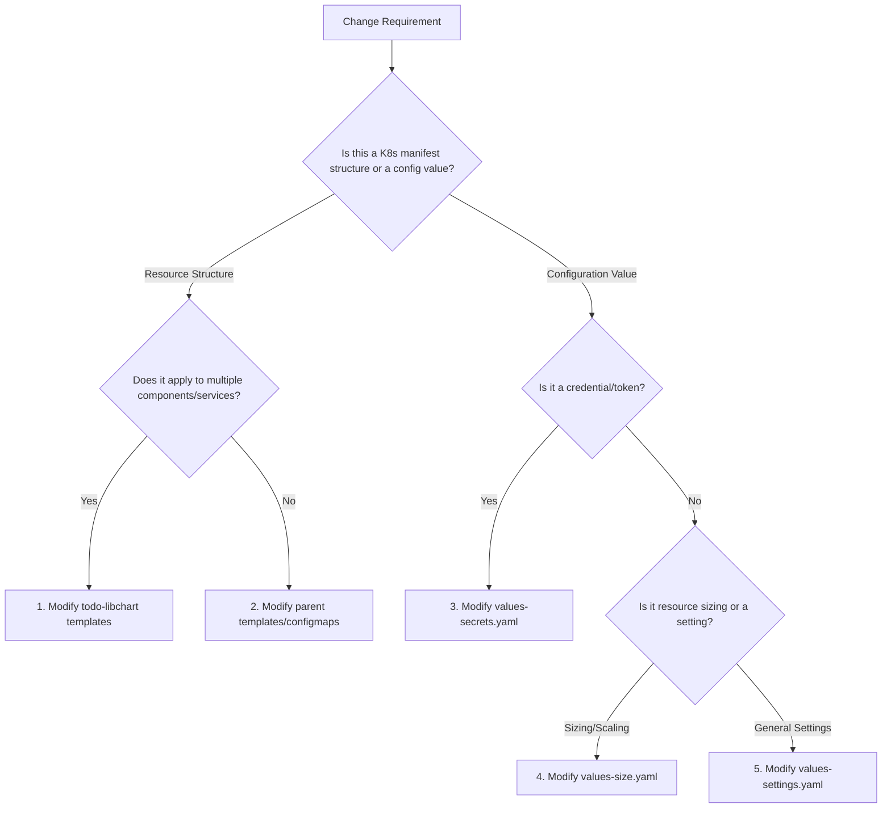

# Library Chart Modification Playbook: `todo-libchart`

**Target Audience:** DevOps / Platform Engineers & Application Developers  
**Scope:** Safely modifying or extending the shared Kubernetes library chart (`todo-libchart`) and integrating those updates into the parent application chart (`todo-app`).

---

## 1. Decision-Making Matrix: Where Does a Change Belong?

Before editing any files, run through this logic to determine which layer to modify:



---

## 2. Playbook A: Adding a New Resource Template to the Library Chart
*Use this playbook when introducing a new Kubernetes resource type (e.g., PodDisruptionBudget, ServiceAccount, or CronJob) that multiple services in the cluster will share.*

### Step-by-Step Execution Plan

```text
+---------------------------------------+
|  Step 1: Write Library Template File  | -> charts/todo-libchart/templates/_pdb.tpl
+------------------+--------------------+
                   |
                   v
+------------------+--------------------+
|  Step 2: Update Parent Orchestrator   | -> helm/templates/manifest.yaml
+------------------+--------------------+
                   |
                   v
+------------------+--------------------+
|  Step 3: Define Parameters in Values  | -> helm/values-settings.yaml
+------------------+--------------------+
                   |
                   v
+------------------+--------------------+
|  Step 4: Package & Rebuild Dep        | -> helm dependency build helm/
+------------------+--------------------+
                   |
                   v
+------------------+--------------------+
|  Step 5: Lint & Render Verification   | -> helm lint & helm template
+------------------+--------------------+
                   |
                   v
+------------------+--------------------+
|  Step 6: Deploy & Verify Live Status  | -> helm upgrade & kubectl get pdb
+------------------+--------------------+
```

### Detailed Task Details

#### Task 1: Create the Library Template File
Create the template file (e.g. `_pdb.tpl`) under `helm/charts/todo-libchart/templates/`. Ensure the template loops over `.Values.components`, filters for enabled instances, and uses safe defaults.

*File:* `helm/charts/todo-libchart/templates/_pdb.tpl`
```yaml
{{- define "todo-libchart.pdb.tpl" -}}
{{- $root := . -}}
{{- range $key, $val := .Values.components }}
  {{- if and ($val.enabled | default false) ($val.pdb) ($val.pdb.enabled | default false) }}
    {{- with $root }}
apiVersion: policy/v1
kind: PodDisruptionBudget
metadata:
  name: {{ $val.pdb.name | default (printf "%s-pdb" $val.name) }}
  namespace: {{ .Values.namespace | default .Release.Namespace }}
  labels:
    {{- include "todo-libchart.labels" (dict "root" . "component" $val) | nindent 4 }}
spec:
  minAvailable: {{ $val.pdb.minAvailable | default 1 }}
  selector:
    matchLabels:
      {{- include "todo-libchart.selectorLabels" (dict "root" . "component" $val) | nindent 6 }}
---
    {{- end }}
  {{- end }}
{{- end }}
{{- end }}
```
*Note: The trailing `---` is critical to separate the resources generated during the component iteration.*

#### Task 2: Update Parent Orchestrator
Instruct the parent chart to call the new template.
*File:* `helm/templates/manifest.yaml`
```yaml
{{- include "todo-libchart.deployment.tpl" . -}}
{{- include "todo-libchart.service.tpl" . -}}
{{- include "todo-libchart.ingress.tpl" . -}}
{{- include "todo-libchart.pdb.tpl" . -}}  # <-- Call the new PDB engine here
```

#### Task 3: Declare Parameters in Values
Enable the resource for target components inside the parent value profiles.
*File:* `helm/values-settings.yaml`
```yaml
components:
  api:
    enabled: true
    name: todo-api
    pdb:
      enabled: true
      minAvailable: 1
```

#### Task 4: Package and Rebuild the Dependency
Local dependency modifications must be packaged so the parent chart compiles the updated subchart.
```bash
helm dependency build helm/
```

#### Task 5: Lint and Render Verification
Always validate that the template outputs clean YAML before applying changes.
```bash
# Lint check
helm lint helm/ -f helm/values-common.yaml -f helm/values-settings.yaml -f helm/values-size.yaml -f helm/values-secrets.yaml

# Render Dry-Run
helm template todo-app helm/ -f helm/values-common.yaml -f helm/values-settings.yaml -f helm/values-size.yaml -f helm/values-secrets.yaml
```

#### Task 6: Deploy and Verify Live Resource
Deploy to your target cluster namespace:
```bash
helm upgrade --install todo helm/ -f helm/values-common.yaml -f helm/values-settings.yaml -f helm/values-size.yaml -f helm/values-secrets.yaml

# Verify resource creation
kubectl get pdb -n todo-app
```

---

## 3. Playbook B: Editing an Existing Library Configuration (e.g. Adding a New Variable)
*Use this playbook when adding support for a new Pod feature, such as custom environment variables, resource limits, or probes.*

### Step-by-Step Execution Plan

#### Task 1: Update the Library Manifest Logic
Locate the relevant template inside the library chart and add the parameter. **Crucial:** Always wrap the variable in a `default` helper or conditional statement to maintain backward compatibility for other services.

*Example:* Adding a custom command override to `_deployment.tpl`
*File:* `helm/charts/todo-libchart/templates/_deployment.tpl`
```yaml
      containers:
        - name: {{ $val.containerName | default $key }}
          image: "{{ $val.image.repository }}:{{ $val.image.tag | default "latest" }}"
          {{- if $val.command }}
          command:
            {{- toYaml $val.command | nindent 12 }}
          {{- end }}
```
*If we had omitted the `if $val.command` check, any service without a command defined would render empty YAML nodes and crash the deployment.*

#### Task 2: Update the Parent Values
Inject the new configuration under the target component.
*File:* `helm/values-settings.yaml`
```yaml
components:
  api:
    command:
      - /app/entrypoint.sh
      - --run-migrations
```

#### Task 3: Build & Lint & Test
```bash
# Rebuild local dependency
helm dependency build helm/

# Dry-run template render to check structure
helm template todo-app helm/ -f helm/values-common.yaml -f helm/values-settings.yaml -f helm/values-size.yaml -f helm/values-secrets.yaml

# Apply upgrade
helm upgrade --install todo helm/ -f helm/values-common.yaml -f helm/values-settings.yaml -f helm/values-size.yaml -f helm/values-secrets.yaml
```

---

## 4. Pre-Commit Production PR Checklist

Before submitting a Pull Request (PR) with library modifications, complete these checks:

- [ ] **Lint Validation:** `helm lint` completes with `0 errors`.
- [ ] **Dry-Run Rendering:** `helm template` generates structurally correct manifests.
- [ ] **Backward Compatibility:** All new variables use the `default` helper or `if` conditionals to prevent compilation failures for other microservices.
- [ ] **Unique Selector Preservation:** Selector labels have not been altered (retaining immutable selectors like `app: todo-api`).
- [ ] **Resource Isolation:** Sizing settings (CPU, Memory limits, PVC storage sizes) reside in `values-size.yaml`, settings in `values-settings.yaml`, and secrets in `values-secrets.yaml`.
- [ ] **Dependency Alignment:** Ran `helm dependency build` and confirmed the `Chart.lock` file is updated and committed.
